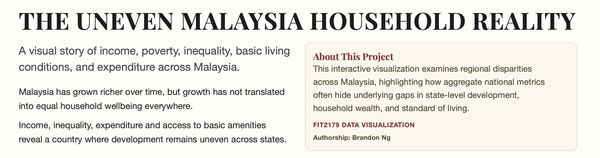
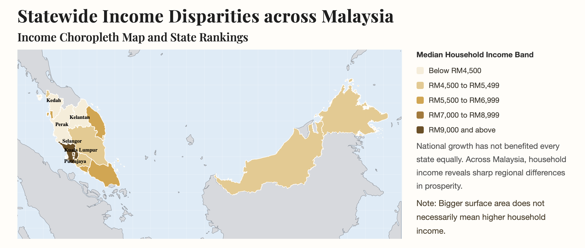
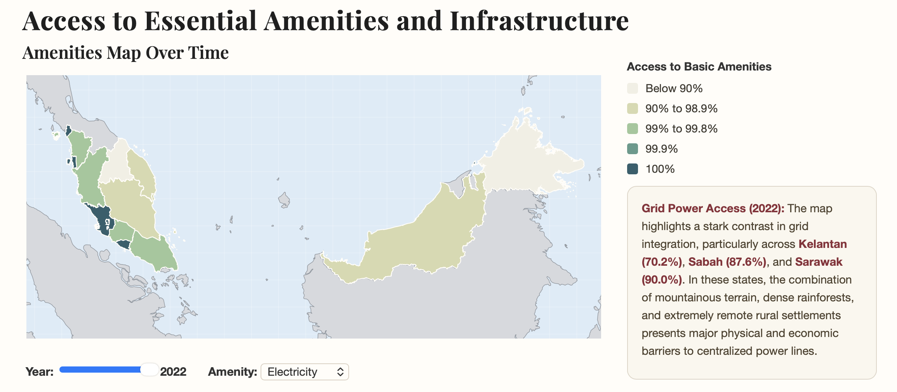

# Interactive Data Visualisation Website | FIT2179

## Overview

This project is an interactive data visualisation website exploring household wellbeing and regional inequality across Malaysia. It uses household income, poverty, Gini coefficient, expenditure, amenities, and percentile distribution datasets to show how national growth can hide uneven state-level development. Users can compare trends over time, inspect geographic disparities, and explore how income relates to poverty, inequality, spending, and access to basic services.

## Features

- Interactive Vega-Lite visualisations embedded in a static web page.
- National household income and household growth trend charts with a shared year slider.
- State-level income choropleth map and income ranking chart with linked state highlighting.
- Absolute poverty choropleth map and income-poverty scatterplot for comparing economic vulnerability across states.
- Gini coefficient trend chart with a state dropdown and dynamically updated insight text.
- Income versus Gini and income versus expenditure comparison charts.
- State expenditure ranking chart for comparing average monthly household spending.
- Amenities map with controls for year and amenity type, covering piped water, sanitation, and electricity access.
- National percentile distribution chart showing income gaps across household percentiles.
- Responsive layout and custom styling for a narrative data storytelling experience.

## Technologies Used

- HTML
- CSS
- JavaScript
- Vega
- Vega-Lite
- Vega-Embed
- CSV datasets
- TopoJSON / GeoJSON map data
- Google Fonts
- GitHub Pages

## Live Demo

https://bdonng35.github.io/FIT2179/

## Screenshots

Selected screenshots from the interactive visualisation website:

- **Homepage / Overview:** 
- **Interactive Map Section:** 
- **Comparison Chart Section:** 

## Project Structure

```text
.
├── index.html              # Main static webpage and narrative structure
├── css/
│   └── styles.css          # Custom page layout, typography, legends, and responsive styling
├── javascript/
│   ├── main.js             # Vega-Lite chart embedding and dynamic insight updates
│   └── inteactivity.js     # Shared year slider logic for the first section
├── charts/
│   └── *.json              # Vega-Lite chart specifications
├── data/
│   ├── *.csv               # Household income, poverty, expenditure, amenities, and inequality datasets
│   ├── malaysia_map.topojson
│   └── malaysia.state.geojson
└── DV2_sketch.pdf          # Project sketch/reference document
```
